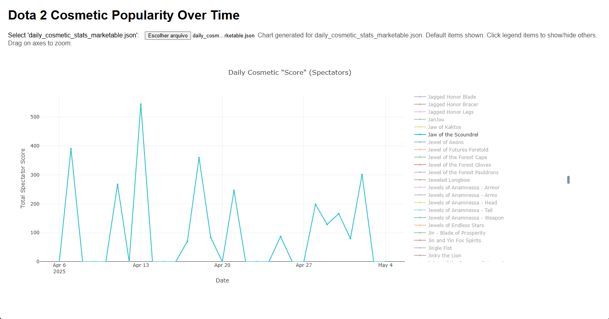

# Skin Scoreboard

This tool tracks Dota 2 cosmetic popularity by analyzing OpenDota live match data, identifying cosmetics in highly-spectated games, and aggregating daily usage statistics from the most watched matches.

Experimental project for my first real code experience, actively developed. Expect frequent changes. **Use with caution, at your own risk**.



**Upcoming (v0.5 MVP):**
*   ~~MongoDB full migration (speedy DB queries)~~ _(dropped for now)_
*   Usage indicators (better data comprehension)
*   Marketplace price analysis (actual usefulness for the data)
*   Visualization module (better insights)

## Setup

1.  **Prerequisites:** Ensure you have [Node.js](https://nodejs.org/) (includes npm) installed.
2.  **Clone Repository:** Clone this repository to your local machine.
3.  **Install Dependencies:** Navigate to the project directory in your terminal and run:
    ```bash
    npm install
    ```
4.  **Configuration:** Review `src/config.js` and adjust settings like polling intervals, or data directories if you want (not required).

## Usage

The project workflow involves two main phases: (1)continuously fetching live data and (2)periodically processing that data through several steps.

1.  **Start Live Data Fetching (Continuous):**
    This script (`step1_fetch_live.js`) runs indefinitely, polling the OpenDota live API every 15 minutes (default). It should be run in a separate terminal or managed by a process manager (e.g., `pm2`). Be sure your terminal is at the folder ~/src/module1, then run:
    ```bash
    node src/module1/step1_fetch_live.js
    ```

    *There is also a step1.bat that works exacly the .js file, but you can run by typing `./step1.bat` or just double clicking the file.

2.  **Run Data Processing Steps (Periodically):**
    After `step1` has collected enough data, run the subsequent steps (`step2` through `step5`) to process it. These steps are designed to be run sequentially.

    *   **Recommended:** Use the provided `run_all.bat` file to run steps 2-5 automatically.
        
    *   **Alternatively:** Run each step individually.
        ```bash
        node src/module1/step2_filter_top_matches.js
        node src/module1/step3_fetch_match_details.js
        node src/module1/step4_extract_match_data.js
        node src/module1/step5_update_database.js
        ```
3.  **Visualize Parsed Data:**
    Simple open `plot_cosmetics.html` with any browser and select either `daily_cosmetic_stats_marketable.json` or `daily_cosmetic_stats.json` files to load the data. Activate or deactivate the plotting by clicking on an item name. **Beware: the visualization tool is not optimized and is just a makeshift tool I made while finishing the rest of the code. I plan to build another visualization tool later.**


## Notes

*   Be mindful of OpenDota API rate limits. Default settings in `config.js` are conservative.
*   Step 3 includes a check (`minimumMatchAgeHours` in `config.js`) to ensure match details are likely parsed already. I plan to add a parsing request for the unparsed matches (parse requests counts as 10 requests to Open Dota API)
*   Data from `raw`, `matches`, and `filtered_matches` directories is preserved for potential reprocessing or analysis.
